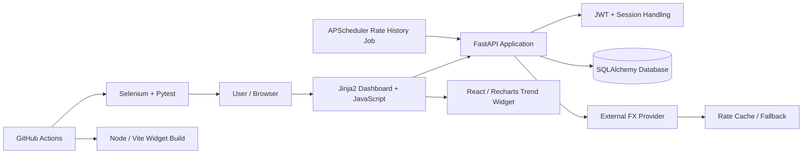

# Currency Exchange Tracker

[](https://github.com/thabo81/currency-exchange-tracker/actions/workflows/tests.yml)
[](https://currency-exchange-tracker-app.onrender.com)

A full-stack currency exchange application built with **Python, FastAPI, SQLAlchemy, Jinja2, JavaScript, React, Recharts, and Selenium**.

The application provides live/cached currency conversion plus authenticated user features including favourites, portfolio holdings, conversion history, rate trends, and target-rate alerts.

> **Portfolio focus:** This project demonstrates a complete QA/SDET workflow: exploratory testing, defect investigation, API testing, Selenium UI automation with the Page Object Model, regression testing, CI/CD, production verification, and defect-driven remediation.

## Project Status

**Completed and production-verified.**

- Phase 1 — Authentication: complete
- Phase 2 — Currency conversion reliability: complete
- Phase 3 — Premium dashboard, responsive UX, history, trends, and session recovery: complete
- Automated regression suite: passing
- GitHub Actions: passing
- Render deployment: verified
- Phase 3 manual acceptance: approved
- Open GitHub issues: 0

## Live Application

**Production:** https://currency-exchange-tracker-app.onrender.com

The production deployment is used for manual smoke testing and environment-level verification. The Selenium UI suite is also designed to accept a configurable `BASE_URL` / `--base-url` so the same automation can target local or deployed environments.

## What the Application Does

### Currency conversion
- Converts between supported currencies.
- Uses live exchange-rate data when available.
- Falls back to cached/default rate data when the provider is unavailable.
- Separates conversion preview from persisted conversion history.
- Shows the converted value with currency symbol/code and rate-source information.

### Authentication and session management
- Direct account registration.
- Password hashing.
- JWT access and refresh tokens.
- Refresh-token flow for expired access tokens.
- Explicit handling of invalid/expired sessions.
- Authenticated user identity displayed in the dashboard.
- No email verification or OTP workflow is required.

### Personal finance features
- Save and remove favourite currency pairs.
- Track portfolio holdings.
- Review authenticated conversion history.
- Create and manage target-rate alerts.
- Analyse stored trend data on a dedicated Trends screen.
- Light/dark theme support.
- Responsive desktop/tablet/mobile layouts.

## Architecture Overview

The application uses a small full-stack architecture with a Python API/backend, server-rendered dashboard, browser-side application logic, a React/Recharts trend widget, persistent storage, and automated QA assets.



See [Architecture](docs/ARCHITECTURE.md) for the component responsibilities and request/data flows.

## Technology Stack

| Area | Technology |
|---|---|
| Language | Python |
| Backend | FastAPI, Uvicorn |
| Data layer | SQLAlchemy |
| Database | SQLite locally/CI; PostgreSQL supported for deployment |
| Server-rendered UI | Jinja2, HTML, CSS, JavaScript |
| Trend visualization | React, Recharts, Lucide React |
| Browser automation | Selenium WebDriver |
| Test framework | Pytest |
| HTTP/API testing | FastAPI TestClient, HTTPX |
| Authentication | JWT, password hashing |
| Scheduling | APScheduler |
| CI/CD | GitHub Actions |
| Deployment | Render |

## QA / SDET Engineering

This repository is deliberately structured as a **testable application**, not only as a feature demo.

### Test strategy
- Functional testing of core workflows.
- API/backend validation independent of the browser UI.
- Selenium browser automation for critical user journeys.
- Page Object Model for reusable UI interaction and selectors.
- Boundary-value and negative testing for validation rules.
- Authentication and authorization checks.
- Regression testing after defect fixes.
- Exploratory testing across desktop and mobile layouts.
- Production smoke verification.
- CI execution on pull requests and pushes to `main`.

### Automated test coverage

The current GitHub Actions regression run executes **44 tests successfully**.

The automated suite covers:

| Area | Examples |
|---|---|
| Authentication | Registration, login, duplicate registration, access/refresh token separation |
| Validation | Password boundaries, amount boundaries, currency-code boundaries |
| Conversion | Conversion accuracy, unsupported currencies, cached fallback, malformed provider data |
| History | Preview does not persist; authenticated conversion is stored |
| Security | Invalid access token rejection; protected token-type boundaries |
| Favourites | Add/remove and persistence behaviour |
| Portfolio | Add/remove holding |
| Alerts | Add/remove and direction validation |
| Trends | Available/missing trend-data rendering |
| UI | Registration/login flow and currency conversion flow |

Latest successful CI execution: **GitHub Actions run #82** on the merged `main` commit.

> CI completed with **44 passed, 10 warnings**. The warnings are dependency/framework deprecation warnings; they did not fail the test run.

See [Final Test Summary](docs/TEST_SUMMARY.md) for the evidence and final acceptance record.

## Defect-Driven Testing

A major part of the project was using testing to discover problems rather than only verifying the happy path.

Two representative defects were investigated and fixed:

### Production API environment defect
The frontend originally used a hardcoded `localhost` API base URL. This worked locally but caused production API requests to target the user's own machine.

**Resolution:** changed the frontend to use relative API paths so the same client code works in local and deployed environments.

### Test-framework environment defect
The Selenium Page Object Model originally hardcoded `localhost`, preventing the same UI tests from targeting Render.

**Resolution:** introduced a configurable `base_url` fixture with CLI/environment support.

These defects are documented in [Defect Log](docs/DEFECT_LOG.md).

## CI Pipeline

The GitHub Actions workflow validates both frontend and backend assets before completing the regression suite.

The pipeline:

1. Checks out the repository.
2. Installs Python 3.12.
3. Installs Node.js 20.
4. Runs `npm ci`.
5. Runs TypeScript type checking.
6. Builds the React/Recharts trend widget.
7. Verifies the generated static bundle exists.
8. Installs Chrome.
9. Installs Python dependencies.
10. Starts FastAPI.
11. Runs the complete Pytest suite.
12. Prints server logs only when the test job fails.

[View GitHub Actions](https://github.com/thabo81/currency-exchange-tracker/actions)

## Project Structure

```text
currency-exchange-tracker/
├── app/
│   ├── main.py                  # FastAPI application and core routes
│   ├── auth.py                  # JWT and password utilities
│   ├── database.py              # SQLAlchemy database configuration
│   ├── dependencies.py          # Shared request/auth dependencies
│   ├── models.py                # SQLAlchemy models
│   ├── schemas.py               # Request validation schemas
│   ├── services.py              # Exchange-rate and conversion logic
│   ├── rate_history_job.py      # Scheduled trend-data collection
│   ├── routers/features.py      # Portfolio, favourites, alerts, history, trends
│   ├── templates/               # Jinja2 login/dashboard templates
│   └── static/                  # CSS, JavaScript, compiled trend widget
├── frontend/
│   ├── src/main.tsx             # React/Recharts trend widget
│   ├── vite.config.ts           # Widget build configuration
│   ├── package.json             # Frontend dependencies/scripts
│   └── package-lock.json
├── pages/
│   ├── base_page.py             # Shared Selenium page behaviour
│   ├── login_page.py            # Login/register Page Object
│   └── dashboard_page.py        # Dashboard Page Object
├── tests/
│   ├── conftest.py              # Fixtures and environment configuration
│   ├── test_auth.py             # Authentication, validation, security
│   ├── test_conversion_service.py
│   ├── test_dashboard_features_ui.py
│   ├── test_registration_ui.py
│   └── test_ui.py
├── docs/
│   ├── ARCHITECTURE.md
│   ├── TEST_PLAN.md
│   ├── TEST_SUMMARY.md
│   └── DEFECT_LOG.md
├── .github/workflows/tests.yml
├── requirements.txt
└── README.md
```

## Run Locally

### Prerequisites
- Python 3.12+
- Chrome for Selenium tests
- Git
- Node.js 20+ and npm only when rebuilding the trend widget

### Install Python dependencies

```bash
python -m venv .venv
```

Windows PowerShell:

```powershell
.venv\Scripts\Activate.ps1
```

macOS/Linux:

```bash
source .venv/bin/activate
```

```bash
python -m pip install --upgrade pip
pip install -r requirements.txt
```

### Environment configuration

Create a local `.env` file:

```env
DATABASE_URL=sqlite:///./currency_exchange.db
JWT_SECRET=replace_with_a_local_development_secret
RATE_API_KEY=
```

Do not commit real credentials or API keys.

### Build the trend widget

Only required when the React/Recharts widget needs to be rebuilt:

```bash
cd frontend
npm ci
npm run typecheck
npm run build
cd ..
```

### Start the application

```bash
uvicorn app.main:app --reload
```

Open:

http://localhost:8000

## Run the Tests

Run the complete suite:

```bash
pytest -v
```

Run specific suites:

```bash
pytest tests/test_auth.py -v
pytest tests/test_conversion_service.py -v
pytest tests/test_dashboard_features_ui.py -v
pytest tests/test_registration_ui.py -v
pytest tests/test_ui.py -v
```

Run the UI suite against another environment without editing Page Objects:

```bash
pytest tests/test_ui.py -v --base-url=https://currency-exchange-tracker-app.onrender.com
```

Or:

```bash
BASE_URL=https://currency-exchange-tracker-app.onrender.com pytest tests/test_ui.py -v
```

## Screenshots

The repository is prepared for a final product walkthrough with screenshots of the **real deployed application**.

Recommended captures:
- Login / registration
- Overview dashboard
- Convert screen
- Trends + threshold state
- Portfolio
- History
- Alerts
- Mobile layout

Screenshots should be stored under `docs/screenshots/` and referenced here once captured from the production deployment.

> Screenshots should be real application captures rather than generated mockups so the portfolio evidence matches the deployed product.

## Documentation

- [Architecture](docs/ARCHITECTURE.md)
- [Test Plan](docs/TEST_PLAN.md)
- [Final Test Summary](docs/TEST_SUMMARY.md)
- [Defect Log](docs/DEFECT_LOG.md)
- [SDET Portfolio Case Study](docs/PORTFOLIO_CASE_STUDY.md)
- [Screenshot Capture Guide](docs/screenshots/README.md)
- [GitHub Actions](https://github.com/thabo81/currency-exchange-tracker/actions)

## SDET Portfolio Story

This project demonstrates the workflow expected from a QA Automation / SDET engineer:

**Explore → Identify risks → Design tests → Automate → Investigate failures → Fix defects → Retest → Run regression → Validate CI → Verify production → Document evidence**

The strongest portfolio evidence is not the number of UI screens. It is the engineering process behind them:

- built reusable Selenium Page Objects;
- separated API/backend tests from UI tests;
- tested invalid, boundary, and authentication scenarios;
- diagnosed a production-only configuration defect;
- improved the test framework so UI automation can target multiple environments;
- added frontend build verification to CI;
- used regression testing after fixes;
- manually verified the final application on desktop and mobile;
- closed the release with no remaining GitHub issues.

## Author

**Thabo Addy Mahlangu**

GitHub: [@thabo81](https://github.com/thabo81)
