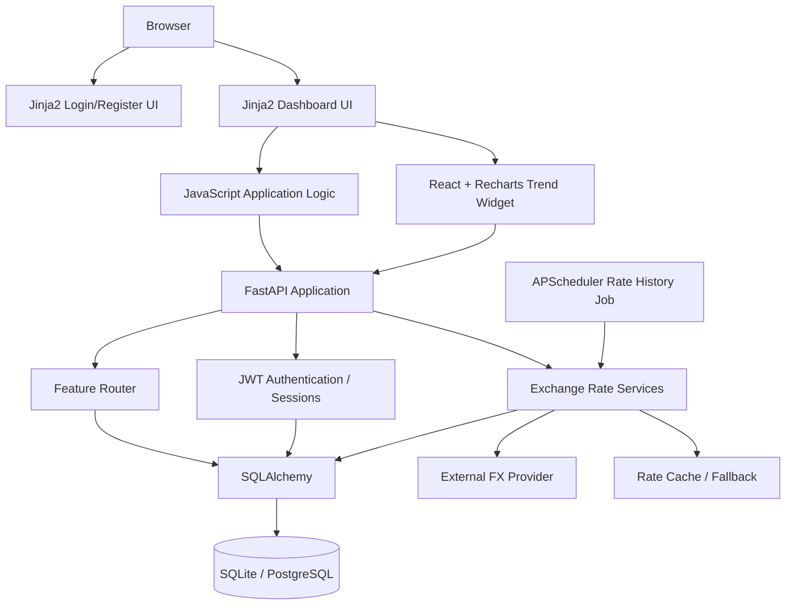
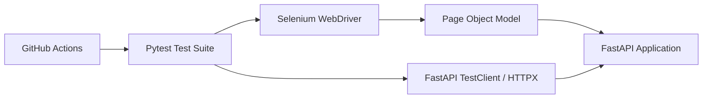

# Architecture — Currency Exchange Tracker

## Overview

Currency Exchange Tracker is a small full-stack application designed around a Python FastAPI backend, a server-rendered dashboard, client-side JavaScript for application interactions, a React/Recharts trend widget, SQLAlchemy persistence, an external exchange-rate provider, and automated QA assets.

## Component Model



## Backend Responsibilities

### `app/main.py`
Application entry point and core HTTP routes. It configures FastAPI, static files, templates, authentication routes, currency conversion, token refresh, and scheduler startup.

### `app/auth.py`
Authentication primitives including password hashing, JWT access/refresh token creation, token decoding, and token hashing.

### `app/dependencies.py`
Shared request dependencies used to resolve optional/authenticated users and enforce protected access patterns.

### `app/routers/features.py`
Feature-oriented API endpoints for:
- favourites;
- portfolio holdings;
- alerts;
- conversion history;
- trend history.

### `app/services.py`
Exchange-rate retrieval and currency-conversion logic. It handles the provider response, cached fallback behaviour, validation, and conversion calculations.

### `app/models.py`
SQLAlchemy persistence models for application data such as users, sessions, cached rates, histories, favourites, holdings, alerts, and trend observations.

### `app/rate_history_job.py`
Scheduled collection of rate-history observations used by the Trends experience.

## Frontend Responsibilities

### Jinja2 templates
`app/templates/login.html` and `app/templates/dashboard.html` provide the main server-rendered application shell.

### JavaScript
`app/static/js/main.js` handles:
- authentication/session state;
- API calls;
- dashboard navigation;
- conversion preview/recording;
- favourites;
- portfolio;
- history;
- alerts;
- settings/theme;
- trend data loading.

### React/Recharts widget
`frontend/src/main.tsx` owns the dedicated chart experience. The production bundle is built by Vite and emitted into `app/static/trend-widget/` so FastAPI can serve it as static content.

## Authentication Flow

```text
Register
  -> password hashed
  -> user persisted

Login
  -> credentials verified
  -> access token + refresh token returned
  -> authenticated identity stored client-side

Protected request
  -> access token attached
  -> backend validates token
  -> user-scoped feature data returned

Expired access token
  -> frontend attempts refresh
  -> new access token issued
  -> original protected request retried once

Refresh failure
  -> stale session cleared
  -> user redirected to login
```

The application intentionally does **not** use email verification or OTP as part of registration.

## Conversion Flow

```text
User changes amount/pair
  -> /convert/preview
  -> rate lookup + fallback logic
  -> conversion result returned
  -> result displayed without creating History

User explicitly records conversion
  -> /convert
  -> authenticated user attached when present
  -> ConversionHistory persisted
```

This separation prevents automatic UI recalculation from creating noisy history records for every keystroke.

## Trends Flow

```text
APScheduler
  -> scheduled rate collection
  -> FxRateHistory persistence

Trends screen
  -> /trends/{base}/{quote}
  -> stored observations loaded
  -> React/Recharts widget rendered

Active alert threshold
  -> threshold reference line
  -> above/below state
  -> threshold-aware visual markers
```

Trend history is based on stored observations rather than fabricated chart data. The current scheduler watches a limited set of currency pairs; arbitrary-pair historical collection is a separate future data-collection concern.

## QA Architecture



The testing architecture deliberately separates:
- backend/API correctness;
- reusable browser interaction;
- test data/configuration;
- CI execution.

## Deployment

The application is deployed as a Render web service running Uvicorn.

The frontend is not a separately deployed SPA. Instead, the React trend widget is compiled into static JavaScript and served by the FastAPI application.

This keeps deployment simple while still allowing a modern React/Recharts component to coexist with the server-rendered application.

## Design Boundaries

The system intentionally keeps some capabilities out of scope:
- automated notification delivery for alerts;
- real-time tick-by-tick market streaming;
- production-scale performance engineering;
- speculative financial predictions/advice;
- arbitrary-pair historical collection beyond the current stored trend strategy.

These boundaries are documented rather than presented as implemented features.
